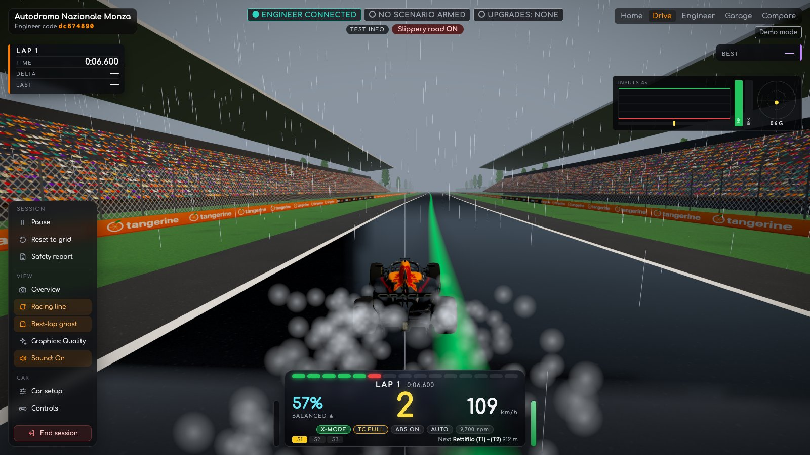
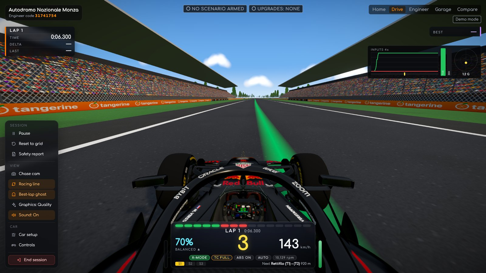
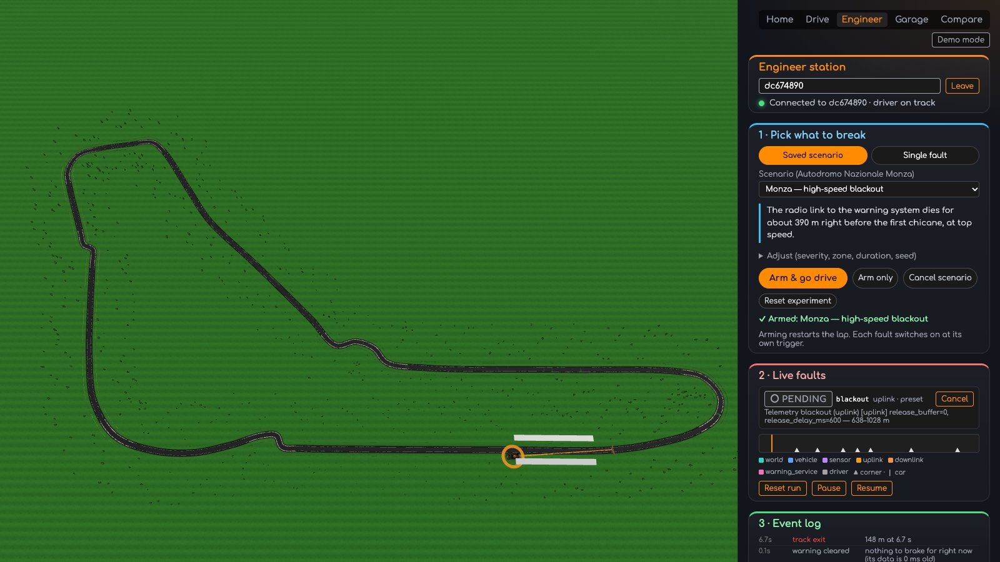
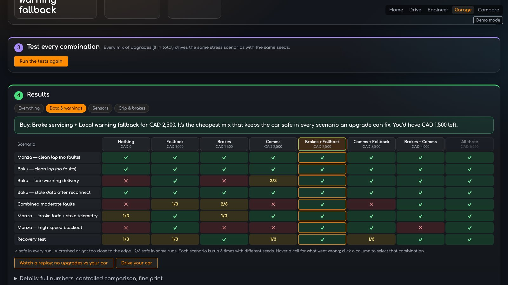
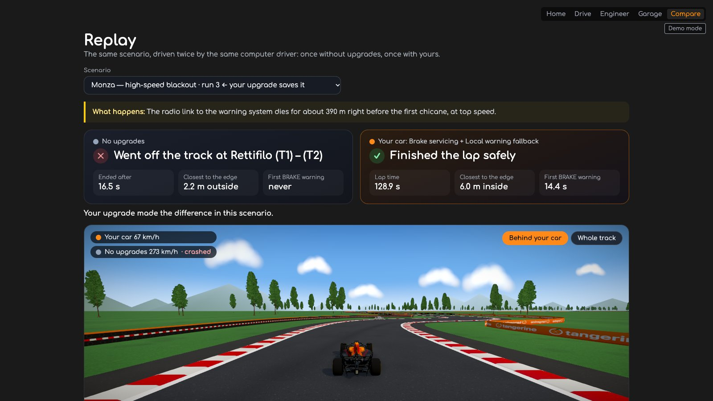
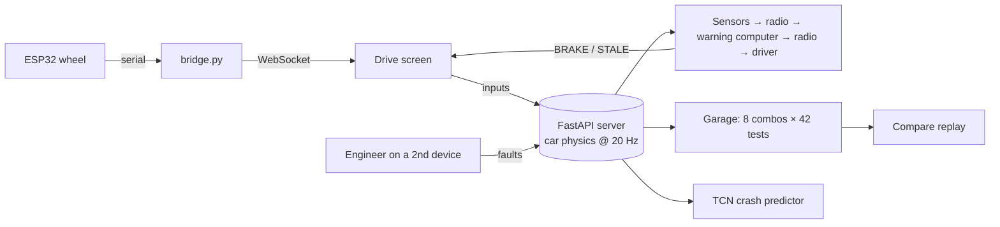

<div align="center">


# ApexTrace

### We crash F1 cars so real ones don't have to.




</div>

---

**334 km/h to 76 km/h in 2.8 seconds.** That's turn one at Monza. The car covers 93 metres every second, and the message that tells the driver *brake now* travels over a radio link to the pit wall and back.

So what happens when that link blinks? When the rain arrives before the grip sensor notices? When the speedometer freezes but still looks healthy?

**ApexTrace is a crash lab for race-car safety warnings.** You drive. Your engineer sabotages you from a second device. Then the garage works out the cheapest fix that actually keeps you on track, and proves it.

---

## 🏎️ Drive



- **Real Monza and Baku layouts:** 5.8 km and 6.0 km, every corner where it should be.
- **A 2026-regulation car:** load-sensitive tyres, downforce, active aero, a 400 kW engine with a 350 kW hybrid kick, traction control and ABS.
- **Kerbs, grass and walls that bite back:** they all grip differently, and walls stop you dead.
- **Engine sound built live from your revs:** gear-shift cuts, overrun crackle and tyre squeal.
- **Rain, a wet reflective road and tyre spray** roll in the moment the engineer makes it slippery.
- **Drive it with the keyboard, a gamepad,** or [our cardboard wheel](#-the-wheel-yes-its-cardboard).

## 💥 Break it



The engineer joins with a code and gets **22 ways to break the car across 7 layers:** road, car, sensors, the radio up to the pit wall, the warning computer, the radio back down, and the driver.

| Scenario | What goes wrong |
| --- | --- |
| **Monza: high-speed blackout** | The radio dies 390 m before turn 1 at 330 km/h. You get *DATA STALE* instead of *BRAKE*. |
| **Monza: wet braking zone** | Rain hits turn 1, and the grip sensor catches on 4 seconds too late. |
| **Baku: speed sensor freeze** | The speedometer sticks. The data looks perfectly fresh. It's lying. |
| **Baku: shared-sensor failure** | Speed reads 20% low *and* arrives late. Even the backup can't save you. |
| **Combined moderate faults** | Two faults that are harmless alone and fatal together. |

Twelve hand-built scenarios, **plus four found by our AI**. Or build your own, one fault at a time, mid-lap.

## 💸 Fund the fix



- **Three upgrades, eight possible combinations.** Every combination drives **42 held-out test laps** (14 scenarios × 3 seeds): 336 laps in under a minute.
- **A real budget:** cash in the bank, minus what's still owed for the season, minus an emergency reserve you never touch.

| | Tests passed | Cost |
| --- | :---: | ---: |
| No upgrades | 14 / 42 | CAD 0 |
| Faster radio (the "obvious" buy) | fixes the least | CAD 2,500 |
| **Brake servicing + onboard fallback** | **31 / 42** ✅ | **CAD 2,500** |
| Buy everything | 31 / 42 | CAD 5,000 |

**The most expensive upgrade barely helps. The cheapest one fixes the most.** A faster radio that's switched off still sends nothing. A CAD 1,000 backup that lets the car warn the driver itself saves it. The 11 tests nothing fixes (frozen sensors, wet braking) are shown in the open: some problems need a better sensor, not a bigger budget.

## 🔁 See the difference



Same scenario, same seed, same computer driver, run twice. The see-through car has no upgrades; the solid one is yours. They match perfectly until the radio dies, then one brakes and one goes straight on.

## 🧠 Two AI models, both honest

**Crash predictor (temporal CNN ensemble, PyTorch)**
- Reads 2.5 s of what the car *reports* and predicts whether it leaves the track in the next second.
- **PR-AUC 0.94** on 153,304 unseen moments, versus 0.08 for a stopping-distance rule and 0.20 even when the rule is handed the true distance to the edge.
- It only watches and never touches the warnings, so it can't make the car less safe.

**Fault-finding adversary (Soft Actor-Critic, Stable-Baselines3)**
- An RL attacker that dials rain, radio lag and brake fade under a hard budget, and learns when to hit.
- **First crash in 410 attempts vs 2,174** for random search, and 14 crashes found vs 8.
- We re-run its crashes on full laps and say so when they don't hold up: 1 of 4 does.

## 🔧 The wheel (yes, it's cardboard)

Our 3D printer never showed up. So we built it out of premium, aerospace-grade cardboard.

- **ESP32** brain, talking to the browser through a Python serial-to-WebSocket bridge
- **2× MPU6050 IMUs** (accelerometer + gyro): tilt the wheel to steer, smoothed with a One-Euro filter
- **HW-504 joystick:** push forward for throttle, pull back to brake, click to reset to the grid
- **1.69" ST7789 colour screen:** your speed, the link status, and a big red **BRAKE**
- **2× SG90 servos:** rumble on kerbs, crashes and warnings

## ⚙️ How it works



The warning under test shows **BRAKE** at the last safe moment:

$$d_{warn} = \frac{v^2 - v_{corner}^2}{2\,a_{brake}} + v\,t_{react} + d_{margin}$$

It only knows what the car *reports*, and every fault attacks exactly that. If its data is more than 0.3 s old, it can't trust it, and the driver sees **WARNING DATA STALE** instead.

## 🚀 Run it

```bash
# terminal 1: the server
cd backend && python3.11 -m venv venv && source venv/bin/activate
pip install -r requirements.txt
uvicorn app.main:app --host 0.0.0.0 --port 8000

# terminal 2: the app
cd frontend && npm install && npm run dev -- --host

# terminal 3 (only with the wheel)
python embedded-firmware/bridge.py
```

- **Drive:** open **http://localhost:5173/#drive** and hit *Start session*.
- **Sabotage:** open `/#engineer` in a second window, or on a phone on the same Wi-Fi, and enter the code.

Controls, the optional detailed car model, tests and everything else are in **[docs/SETUP.md](docs/SETUP.md)**.

## 🧰 Built with

Python · FastAPI · WebSockets · NumPy · PyTorch · Stable-Baselines3 · Gymnasium · TypeScript · React · Vite · three.js · React Three Fiber · Web Audio · ESP32 · Arduino · pytest · Vitest · Puppeteer · cardboard

## 👥 Team

**Aaryan Ved Bhalla · Kahn Shah · Shayan Mazahir**

Built for Formula Tech Hacks 2026.

<sub>ApexTrace is an F1-inspired prototype: a simplified car model and a scripted test driver, not real team data or certification. The point is the testing method.</sub>
